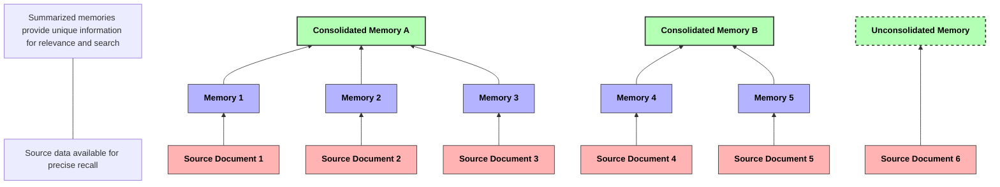
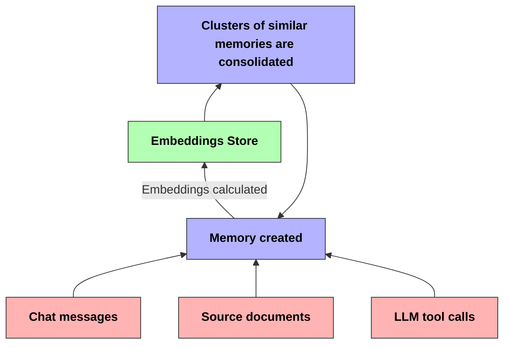

# Recall Kit: Lightweight memory integrations for LLM's


## Quickstart

Recall Kit provides a variety of methods to integrate:

### As a toolset for AI agents:
```bash
# MCP
uv pip install "recall-kit[mcp]"
recall mcp show # prints MCP server settings
```


```bash
# Smolagents
uv pip install "recall-kit[smolagents]"
```

```python
# Approach 1: Recall Kit as Smolagents Tools
from smolagents import Agent
from recall_kit.smolagents import RecallMemoryTool, CreateMemoryTool
from recall_kit import RecallKit

# Initialize Recall Kit
recall = RecallKit()

# Create memory tools
agent = Agent(
    tools=[RecallMemoryTool(recall_kit=recall), CreateMemoryTool(recall_kit=recall)],
    system_prompt="You are an assistant with memory capabilities. Use the memory tools when appropriate."
)

# Use the agent
response = agent.run("Remember that I prefer dark mode for all applications.")
print(response)

# Approach 2: Recall Kit as a Custom AgentMemory
from smolagents import Agent
from recall_kit.smolagents import RecallKitAgentMemory

# Create an agent with automatic memory
agent = Agent(system_prompt="You are an assistant with perfect recall.")
agent.memory = RecallKitAgentMemory(auto_consolidate=True)

# Use the agent
response = agent.run("What were we discussing earlier?")
print(response)
```

### As a OpenAI-compatible model wrapper
```bash
uv pip install recall-kit
recall serve # Exposes model server, which can be used in any service you like.
```


### From the command line
 Standalone CLI
```bash
# Install
uv pip install recall-kit

recall chat # interactive chat
recall remember < "I need to go to the grocery store" # Create memories from stdin
recall ingest /your_docs --include "*md" # Ingest documents from within dir
```

```bash
# Extension to LLM
uv pip install llm-recall-kit
llm -m recall
```


recall-kit is built with the following principles:


1. **Versatility**: Easily any reasonable integration path, including:
    -  MCP
    - Agent tools for [Smolagents](https://github.com/huggingface/smolagents), and others
    - OpenAI compatible endpoint
    - CLI tools like [llm](https://github.com/simonw/llm)

1. **Small footprint**: Do not require a large presence in the surrounding application, require minimal dependencies.

1. **Composability**: Allow user to customize all stages of memory capture and recall.

1. **Vanilla data stores**: recall-kit supports `Sqlite` (with [sqlite-vec](https://github.com/asg017/sqlite-vec)) and Postgres (with [pgvector](https://github.com/pgvector/pgvector)). It does not leverage dedicated graph databases.

1. **Show your work**: Always make the recalled context accessible to the user.

### Memory structure



In recall-kit, memories are free text excerpts, linked to source data. As more memories are added, those with similar embeddings are consolidated. This creates a consistent, curated memory collection available for LLM searching.

Source data is retained, linked to memories, and made available when more precise recall is required.


### Life of a memory

#### Creating and managing memories




1. Capture: Memories are created, either from chat transcript or any other kind of document
1. Embeddings are calculated and stored
1. Consolidation: Redundant memories are consolidated with each other, forming new memories.


#### Recalling memories

```mermaid
flowchart LR
    %% Main components
    RQ["Requests"] --> CE["Calculate embeddings"]
    CE --> ES["Embeddings Store"]
    ES --> FR["Filter for relevancy"]
    FR --> RR["Rerank"]
    RR --> MAR["Memory augmented Request"]
    RQ --> MAR
    MAR --> API["OpenAI compatible API"]

    %% Styling
    classDef request fill:#b3b3ff,stroke:#333,stroke-width:1px,color:#000,font-weight:bold
    classDef process fill:#b3b3ff,stroke:#333,stroke-width:1px,color:#000,font-weight:bold
    classDef store fill:#b3ffb3,stroke:#333,stroke-width:1px,color:#000,font-weight:bold,shape:cylinder
    classDef api fill:#ffb3b3,stroke:#333,stroke-width:1px,color:#000,font-weight:bold

    class RQ,MAR request
    class CE,FR,RR process
    class ES store
    class API api
```



1. Retrieval: During LLM chat, memories are searched and candidates are retrieved
1. Filtering: Results are filtered for relevancy.
1. Re-ranking: Results are re-ranked
1. Integration: Retrieved memories are incorporated into LLM requests.
1. Source retrieval: If necessary, retrieve source documents for more precise retrieval


`recall-kit` provides sensible defaults for all of these steps, but all of them can be customized.

## Customizing

The memory needs of an LLM can vary widely - optimizations might be needed in summarization, consolidation, relevance filtering, or in combinging recalled content with chat requests. More processing will result in richer responses, at the cost of higher latency.

`recall-kit` comprises of the following components:

- SQLAlchemy
    - Default: sqlite3
    - add postgres support with `uv pip install "recall-kit[postgres]"`
- Vector store: A K/V supporting `search`, `remove`, and `upsert`.
    - Default: sqlite-vec
    - postgres / pgvector support with `uv pip install "recall-kit[postgres]"`
- Functions:
    - `embedding`: LLM
    - `completion`: Chat completion client
    - Memory source: Combination of:
        - A class
        - A a `to_memory` function, returning text and a title
        - An `address` field
    - The following functions:
        - `retrieve`: Accepts query text, and a chat completion request, returns a collection of memory instances
        - `filter` (optional): Accepts a memory and a chat completion request, returns a boolean.
        - `rerank` (optional): Accepts a list of memories, and a chat completion request. Returns a list of memories.
        - `augment`: Accepts a list of memories and a chat completion request, returns a chat completion request


TODO: description of how plugin system will work.


# Roadmap

There features are not in the current version of recall-kit, but maybe added in the future:
- langchain integration
